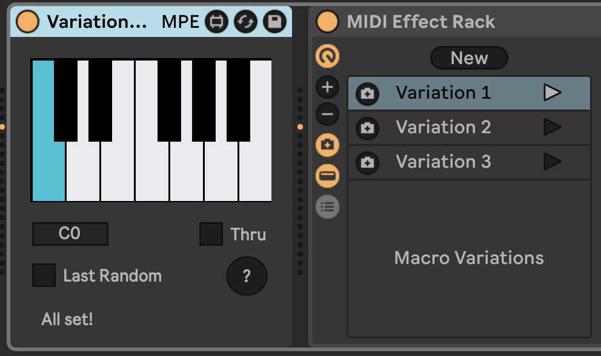

# VariationOctave

This is a Max for Live MIDI device that allows you to dedicate an octave of the keyboard to selecting variations in an adjacent rack. It can optionally randomize the Macros with the last note of the octave.

## Installation

Download using the buttons at the top and bottom of this page, or go to the latest [release on GitHub](https://github.com/zsteinkamp/m4l-VariationOctave/releases) and download it there.

## Usage

Place VariationOctave immediately prior to the MIDI Effect Rack or Instrument Rack you want to control with it.

Select a base note for the octave VariationOctave will monitor.

`Thru`: Choose whether you want the detected notes to be passed on to the output. Notes outside the monitored octave are always passed through.

`Last Random`: Choose whether you want the last note of the octave to trigger randomizing the Macros in the rack.

## Changelog

- 2025-04-04 [v1](https://github.com/zsteinkamp/m4l-VariationOctave/releases/download/v1/VariationOctave-v1.amxd) - Initial release.
